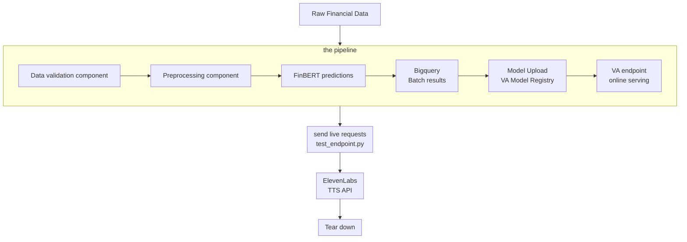

# INFERENCE PIPELINE FOR FINANCIAL SENTIMENTS ANALYSIS WITH TTS INTEGRATIONS
## Architecture Diagram

[Architectural Diagram](../INF%20PIPELINES/diagram/inference%20pipeline.png)

## Brief Description
### Introduction
### Components
### Results and Conclusions

## Set-up Instructions
### File structure
### Infrastructure as code (IaC)
### Google Cloud Platform 
### Operations

## Replication Instructions: Steps
### GCP console set up
### gcloud env vars
### Terraform
### Provisioning and 
### Running

## VERSIONS
This project is divided into versions: 
 - v1-pipeline : end to end inference pipeline of financial sentiments analysis using twitter financial dataset with manual pipeline launch and batch inference.
 - v2-req-endpoint: end to end inference pipeline of financial sentiments analysis using twitter financial dataset with manual pipeline launch and batch inference and live request vertex ai endpoint for single inference requests
 - v3-ci-cd: end to end inference pipeline of financial sentiments analysis using twitter financial dataset with CI/CD and  batch inference and live request vertex ai endpoint for single inference requests
 - v4-tts-api: end to end inference pipeline of financial sentiments analysis using twitter financial dataset with CI/CD and  batch inference and live request vertex ai endpoint for single inference requests and elevenlabs text to speech api

