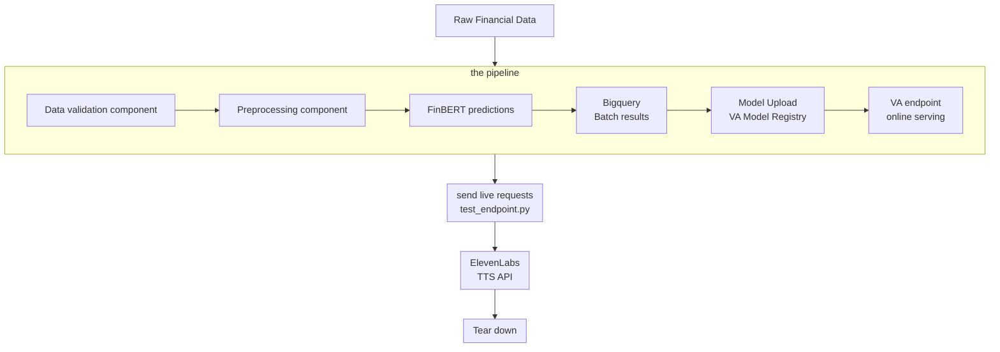

# INFERENCE PIPELINE FOR FINANCIAL SENTIMENTS ANALYSIS WITH TTS INTEGRATIONS
## Architecture Diagram
[Architectural Diagram](../INF%20PIPELINES/diagram/inference%20pipeline.png)

## Brief Description
### Introduction: objectives, definitions, scope
In this project the basic workflow of an inference pipeline for financial sentiments analysis is implemented.  
The objective is to execute both batch and online inference using GCP platform tooling and at the end integrate external APIs. 
This project is entirely implemented with backend functionalities as such, online inference calls are made from file (``test_endpoint.py``) 
### Components
There are 6 components of this pipeline end to end: 
1. Data validation: use of twitter financial sentiments data 
2. Data pre-processing: mapping sentiments accurrately in the data according to the model's expecttations 
3. Model Upload: FinBERT is used and is loaded from Hugginface
4. Bigquery Batch inference: Batch inference is done in GCP bigquery and stored 
5. Vertex AI (VA) endpoint online serving (call from file): a script with input query is sent to a provisioned VA endpoint with the model 
6. ElevenLabs Text to Speech (TTS) integration: The model inference outputs from the the online inference is parsed through a TTS api first in order to generate audio of the response.
### Results and Conclusions
By the end, we have the models predictions for the entire test set of the data as well as the audio files of an online call (when its a request is made)

## Set-up Instructions

### File structure

The project file structure consists of the components, Infrastructure as Code (IaC) and online inference folders. 
### Infrastructure as code (IaC)
The infrastructure provisioning is done mainly with ``Terraform`` on Google Cloud Platform s(GCP)
### Google Cloud Platform (GCP)
1. Storage bucket 
2. Bigquery 
3. Vertex AI (now Gemini Agent platform) (model registry, pipelines, endpoint) 
4. Cloud build 
### Operations
Continuos integration is carried out through a cloud build trigger. Due to cost management deployment to VA endpoints is detached from the pipeline and is instead executed through a script ``test_endpoint.py``

## Replication Instructions: Steps
### GCP console and cloudshell set up
Create all terraform GCP files. create all environments variables. Utilise ``Terraform , gcloud and git``
### Terraform
``terraform init`` 
``terraform plan`` 
``terraform apply``  
### Running
create  cloud build trigger on GCP console by attaching ``cloudbuild.yaml`` with pipeline running steps.

