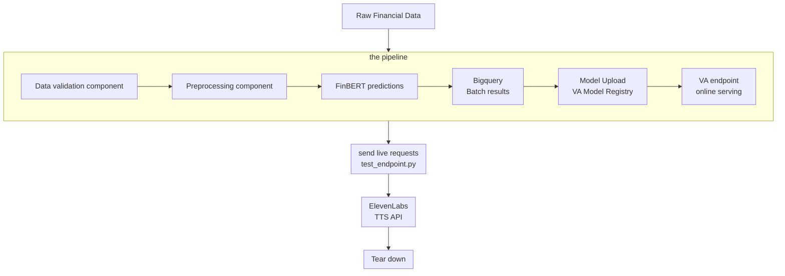

# INFERENCE PIPELINE FOR FINANCIAL SENTIMENTS ANALYSIS WITH TTS INTEGRATIONS
## Architecture Diagram
[Architectural Diagram](../INF%20PIPELINES/diagram/inference%20pipeline.png)

## Brief Description
### Introduction: objectives, definitions, scope
In this project the basic workflow of an inference pipeline for financial sentiments analysis is implemented.  
The objective is to execute both batch and online inference using GCP platform tooling and at the end integrate external APIs. 
This project is entirely implemented with backend functionalities as such, online inference calls are made from file (``call_pipeline.py``) 
### Components
There are 6 components of this pipeline end to end: 
1. Data validation: use of twitter financial sentiments data 
2. Data pre-processing: mapping sentiments accurrately in the data according to the model's expecttations 
3. Model Upload: FinBERT is used and is loaded from Hugginface
4. Bigquery Batch inference: Batch inference is done in GCP bigquery and stored 
5. Vertex AI (VA) endpoint online serving (call from file): a script with input query is sent to a provisioned VA endpoint with the model 
6. ElevenLabs Text to Speech (TTS) integration: The model inference outputs from the the online inference is parsed through a TTS api first in order to generate audio of the response.
### Results and Conclusions
By the end, we have the models predictions for the entire test set of the data as well as the audio files of an online call (when its a request is made)

## Set-up Instructions

### File structure

### Infrastructure as code (IaC)
### Google Cloud Platform 
### Operations

## Replication Instructions: Steps
### GCP console set up
### gcloud env vars
### Terraform
### Provisioning and 
### Running

## VERSIONS
This project is divided into versions: 
 - v1-pipeline : end to end inference pipeline of financial sentiments analysis using twitter financial dataset with manual pipeline launch and batch inference.
 - v2-req-endpoint: end to end inference pipeline of financial sentiments analysis using twitter financial dataset with manual pipeline launch and batch inference and live request vertex ai endpoint for single inference requests
 - v3-ci-cd: end to end inference pipeline of financial sentiments analysis using twitter financial dataset with CI/CD and  batch inference and live request vertex ai endpoint for single inference requests
 - v4-tts-api: end to end inference pipeline of financial sentiments analysis using twitter financial dataset with CI/CD and  batch inference and live request vertex ai endpoint for single inference requests and elevenlabs text to speech api

