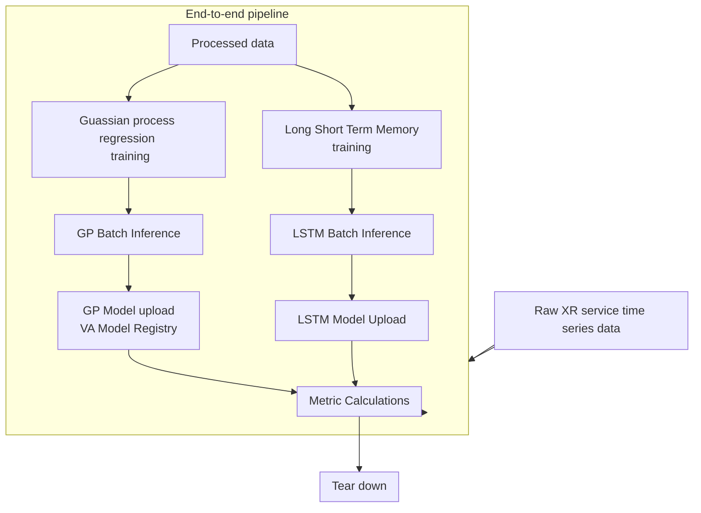

# Long Short Term Memory (LSTM) and Gaussain Process (GP) Extended Reality(XR) User Equipment(UE) Energy Efficiency(EE)

## Introduction
This is the replication of a project I designed and implemented during my PhD in distributed systems and applied machine learning.
### Cellular Network Overview
#### EE for XR
#### ML-driven EE

### Architectural Overview
The overview of the end to end pipeline of the XR EE system(ML-side) is available at:

## Scope
### Sections and Components
#### Monitoring
## Results
### Metric Results

