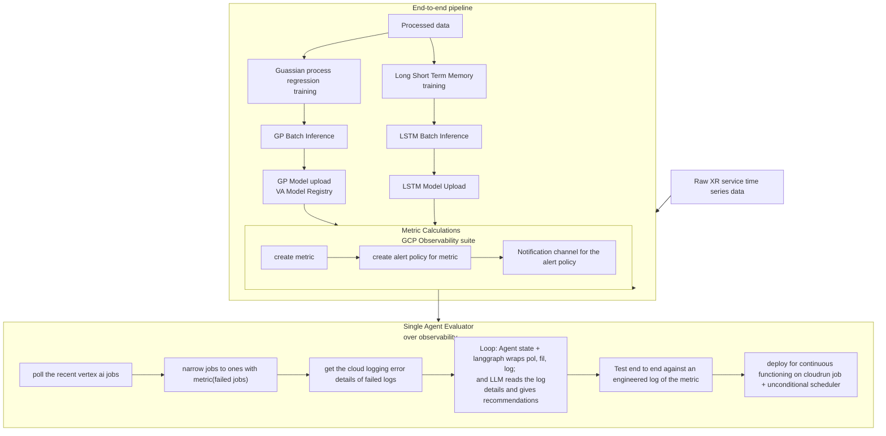

# END TO END MLOps PIPELINE WITH AGENTIC MONITOR
[Architecture Diagram](../LSTM%20GP%20UE%20EE/diagrams/end%20to%20end%20mlops%20pipeline.png)

## Brief Description
### Introduction: Objective, Definitions, Scope
This is the implementation of the full MLOps pipeline from data ingestion to model monitoring. Its a cloud platform implementation of [a project in my PhD](https://www.researchgate.net/publication/385682682_Prediction-based_Discontinuous_Reception_Mechanism_for_Extended_Reality_Applications). Its conceptual objective is to improve energy efficiency (EE) on extended reality (XR) devices using Long Short Term Memory (LSTM) and Gaussian Process (GP) regression models.  

This google cloud platform (GCP) implementation covers data management( ingestion, preprocessing, drift and skew monitoring), model training, batch inference and model monitoring. It also layers a pipeline evaluatory monitoring agent to demonstrate agentic workflow. 
### Components
1. data ingestion and preprocessing: using storage buckets 
2. LSTM and GP training: using Vertex AI (VA) pipelines and training 
3. model upload (to VA model registry) 
4. batch inference: using Bigquery 
### Results
The results of the original work is the comparison of the ML based algorithms to the 3GPP standard for XR device energy efficiency. This covers the metric results of the two algorithms, and the EE-delay tradeoff of the algorithms on the devices compared with the standards  

For the cloud implementation, the results are a combination of the metric results of the two algorithms (i.e. the root mean square error (RMSE)) and GCP observability workflows implemented. 

For the GCP observability, 4 metrics and corresponding alert policies were implemented, namely: 
1. pipeline latency 
2. pipeline failure 
3. prediction drift 
4. row count anomaly (in batch inference) 

Lastly, an agentic workflow was implemented for the pipeline failure metric for demonstration. 
## Set-up Instructions
### File structure
 

### Infrastructure as Code (IaC)
[IaC with Terraform](../LSTM%20GP%20UE%20EE/diagrams/terraform_files.png) 

### GCP Tools
1. Vertex AI (Now Gemini Agent Platform) pipelines, training, model registry 
  - VA pipelines uses kubeflow pipelines 
2. Bigquery 
3. Storage buckets 
4. Indentity and Access Management(IAM) 
5. GCP observability suite  
  - cloud logging  
  - cloud monitoring  
  - error reporting (alert policies, notification channels) 

### Agentic Workflow
1. polling 
2. filtering 
3. ``Langgraph`` looping (of polling and filtering) 
3. test end to end  
4. deploy on server (``cloudrun job + cloud scheduler``) for continuous polling 

## Instant Replication Instructions
### GCP console and cloud shell setup
Create all terraform GCP files. create all environments variables. Utilise Terraform , gcloud and git

### Terraform
``terraform init`` 
``terraform plan`` 
``terraform apply`` 

### Agentic Workflow
- Create the desired functionality for the metric to be polled.  
- Write the cloud logging filter for that metric. 
- Langgraph agent state looping 
- testing and  
- deployment to server (``cloudrun job + cloud scheduler``) and continuos polling 