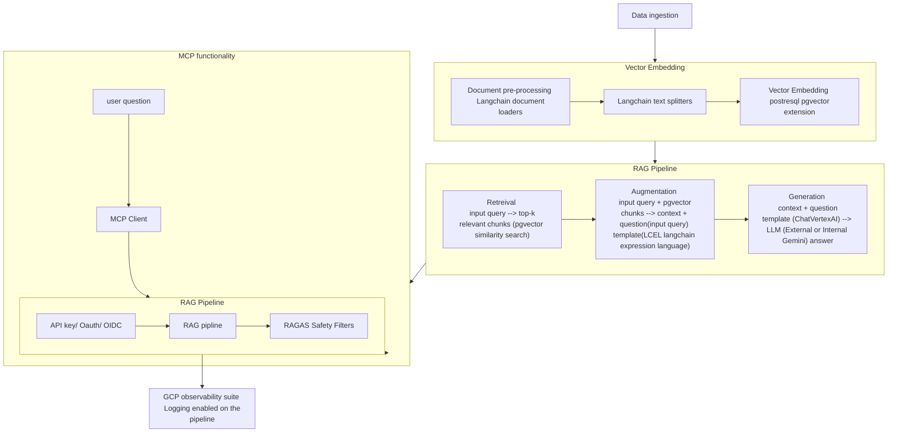

# Retrieval Augmented Generation (RAG) pipeline (for document Q&A) with Model Context Protocol (MCP) Client

[Architecture Diagram](../RAG%20pipeline/diagram/RAG%20pipeline%20with%20MCP.png) 

## Brief Description
### Introduction: Objective, definitions, Scope
In this project, RAG for document query is implemented with MCP client wrapper endpoint (enabling access from external models) and RAGAS filtering. 
The tools utilised for the implementation include:  
1. Langchain (document loaders, text splitters, vector embedding, langchain expression language(LCEL)) 
2. GCP tools (storage buckets, cloudsql(postgresql instance), servers(cloudrun, cloudrun job)) 
At the end, an MCP client endpoint wrapper is implemented over the RAG tooling to enable access from external models and to also seamlessly incorporate authentication/authorisation before access to the RAG tool. 
### Component
1. document ingestion (GCP storage buckets) 
2. document embedding (langchain document loaders) 
3. document spliting, chunk and vector creation (langchain document splitters, pgvector extension) 
4. RAG workflow
### Results
The include a successful request call through the MCP client wrapper to the RAG pipeline and a response in accordance with the documents and safety filters in accordance with checks and balances implemented in the project. 

## Set Up Instructions

## Instant Replication Instructions